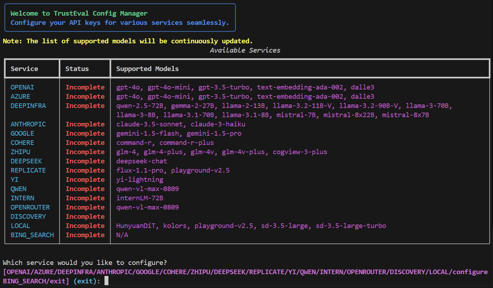

<!-- <p align="center"><h1 align="center">TrustGen </h1></p>

<p align="center">
	<em>TrustGen: A Platform of Dynamic Benchmarking on the Trustworthiness of Generative Foundation Models</em>
</p> -->
<p align="center">
    
</p>


## Video Tutorials

Watch step-by-step tutorials on our YouTube channel:


https://github.com/user-attachments/assets/489501b9-69ae-467f-9be3-e4a02a7f9019


<summary>Table of Contents</summary>

- [Video Tutorials](#video-tutorials)
- [📍 Overview](#-overview)
- [👾 Features](#-features)
- [🚀 Getting Started](#-getting-started)
    - [**1. Set Up a Conda Environment**](#1-set-up-a-conda-environment)
    - [**3. Install Dependencies**](#3-install-dependencies)
- [🤖 Supported Models](#-supported-models)
  - [📝 Large Language Models (LLMs)](#-large-language-models-llms)
    - [**OpenAI Models**](#openai-models)
    - [**Anthropic Claude Models**](#anthropic-claude-models)
    - [**Meta LLaMA Models**](#meta-llama-models)
    - [**Chinese Models**](#chinese-models)
    - [**Google Models**](#google-models)
    - [**Mistral Models**](#mistral-models)
    - [**Other Models**](#other-models)
  - [🎨 Text-to-Image Models (T2I)](#-text-to-image-models-t2i)
    - [**Local T2I Models** (Requires `pip install -e ".[local]"`)](#local-t2i-models-requires-pip-install--e-local)
    - [**API T2I Models**](#api-t2i-models)
  - [🔍 Embedding Models](#-embedding-models)
  - [🚀 Performance Features](#-performance-features)
- [🤖 Usage](#-usage)
    - [**Configure API Keys**](#configure-api-keys)
    - [**Quick Start**](#quick-start)
    - [**Step 0: Set Your Project Base Directory**](#step-0-set-your-project-base-directory)
      - [**Step 1: Download Metadata**](#step-1-download-metadata)
      - [**Step 2: Generate Datasets Dynamically**](#step-2-generate-datasets-dynamically)
      - [**Step 3: Apply Contextual Variations**](#step-3-apply-contextual-variations)
      - [**Step 4: Generate Model Responses**](#step-4-generate-model-responses)
      - [**Step 5: Evaluate and Generate Reports**](#step-5-evaluate-and-generate-reports)
    - [Using the Huggingface Dataset Download Script](#using-the-huggingface-dataset-download-script)
      - [Basic Usage](#basic-usage)
      - [Setting the base\_dir in Your Evaluation Script](#setting-the-base_dir-in-your-evaluation-script)
      - [Next Steps in the Pipeline](#next-steps-in-the-pipeline)
      - [Troubleshooting](#troubleshooting)
- [Trustworthiness Report](#trustworthiness-report)
  - [Test Model Results](#test-model-results)
  - [Model Performance Summary](#model-performance-summary)
  - [Error Case Study](#error-case-study)
  - [Leaderboard](#leaderboard)
- [Contributing](#contributing)
- [Citation](#citation)
- [License](#license)


## 📍 Overview

**Trustgen** is a dynamic and comprehensive framework for evaluating the trustworthiness of Generative Foundation Models (GenFMs) across dimensions such as safety, fairness, robustness, privacy, and more.


## 👾 Features

- **Dynamic Dataset Generation**: Automatically generate datasets tailored for evaluation tasks.
- **Multi-Model Compatibility**: Evaluate LLMs, VLMs, T2I models, and more.
- **Local & API Model Support**: Run models locally or via API endpoints for maximum flexibility.
- **Multi-GPU Acceleration**: Concurrent inference across multiple GPUs for 7-8x speed improvement.
- **Advanced T2I Models**: Support for Stable Diffusion 3.5, FLUX.1-dev, HunyuanDiT, Kolors, and more.
- **Performance Optimizations**: xformers memory efficiency, attention slicing, and optimized pipelines.
- **Customizable Metrics**: Configure workflows with flexible metrics and evaluation methods.
- **Metadata-Driven Pipelines**: Design and execute test cases efficiently using metadata.
- **Comprehensive Dimensions**: Evaluate models across safety, fairness, robustness, privacy, and truthfulness.
- **Detailed Reports**: Generate interactive, easy-to-interpret evaluation reports.

---

> 📖 The documentation can be viewed directly with a browser at TrustGen/docs/html/index.html.

## 🚀 Getting Started

#### **1. Set Up a Conda Environment**

Create and activate a new environment with Python 3.10:

```bash
conda create -n trustgen_env python=3.10
conda activate trustgen_env
```

#### **3. Install Dependencies**

**Basic Installation (API Models Only):**

Install the package with basic dependencies for API-based models:

```bash
pip install .
```

**Full Installation (Including Local Models):**

If you want to run **local Text-to-Image models** (such as Stable Diffusion, FLUX, HunyuanDiT, etc.), install with additional dependencies:

```bash
pip install -e ".[local]"
```

This will install additional packages required for local model inference:
- `diffusers==0.31.0` - Hugging Face Diffusers library for T2I models
- `torch>=2.1.0` - PyTorch for deep learning
- `transformers>=4.41.2` - Transformers library
- `datasets>=2.15.0` - Dataset utilities
- `accelerate==0.30.1` - Hardware acceleration utilities

## 🤖 Supported Models

TrustEval supports a comprehensive range of foundation models across different modalities and providers:

**Recommended API Providers:** For API-based models, we recommend [OpenRouter](https://openrouter.ai/), [DeepInfra](https://deepinfra.com/), and [Replicate](https://replicate.com/) for reliable and cost-effective inference.

### 📝 Large Language Models (LLMs)

#### **OpenAI Models**
| Model | Name | Type | Provider |
|-------|------|------|----------|
| GPT-4o | `gpt-4o` | Chat + Vision | OpenAI API |
| GPT-4o Mini | `gpt-4o-mini` | Chat + Vision | OpenAI API |
| GPT-3.5 Turbo | `gpt-3.5-turbo` | Chat | OpenAI API |
| o1 | `o1` | Reasoning | OpenAI API |
| o1 Mini | `o1-mini` | Reasoning | OpenAI API |
| o1 Preview | `o1-preview` | Reasoning | OpenAI API |

#### **Anthropic Claude Models**
| Model | Name | Type | Provider |
|-------|------|------|----------|
| Claude 3.5 Sonnet | `claude-3.5-sonnet` | Chat + Vision | Anthropic API |
| Claude 3 Haiku | `claude-3-haiku` | Chat + Vision | Anthropic API |
| Claude 3 Opus | `claude-3-opus` | Chat | Anthropic API |

#### **Meta LLaMA Models**
| Model | Name | Type | Provider |
|-------|------|------|----------|
| LLaMA 2 13B | `llama-2-13B` | Chat | DeepInfra API / Local |
| LLaMA 3 8B | `llama-3-8B` | Chat | DeepInfra API |
| LLaMA 3 70B | `llama-3-70B` | Chat | DeepInfra API |
| LLaMA 3.1 8B | `llama-3.1-8B` | Chat | DeepInfra API |
| LLaMA 3.1 70B | `llama-3.1-70B` | Chat | DeepInfra API |
| LLaMA 3.2 11B Vision | `llama-3.2-11B-V` | Chat + Vision | DeepInfra API |
| LLaMA 3.2 90B Vision | `llama-3.2-90B-V` | Chat + Vision | DeepInfra API |

#### **Chinese Models**
| Model | Name | Type | Provider |
|-------|------|------|----------|
| GLM-4 | `glm-4` | Chat | Zhipu API |
| GLM-4 Plus | `glm-4-plus` | Chat | Zhipu API |
| GLM-4V | `glm-4v` | Chat + Vision | Zhipu API |
| GLM-4V Plus | `glm-4v-plus` | Chat + Vision | Zhipu API |
| DeepSeek Chat | `deepseek-chat` | Chat | DeepSeek API |
| Qwen 2.5 72B | `qwen-2.5-72B` | Chat | DeepInfra API |
| QwQ 32B | `qwq-32B` | Reasoning | DeepInfra API |
| Qwen VL Max | `qwen-vl-max-0809` | Chat + Vision | Qwen API |
| Qwen 2 VL 72B | `qwen-2-vl-72B` | Chat + Vision | OpenRouter API |
| Yi Lightning | `yi-lightning` | Chat | Yi API |

#### **Google Models**
| Model | Name | Type | Provider |
|-------|------|------|----------|
| Gemini 1.5 Flash | `gemini-1.5-flash` | Chat + Vision | Google API |
| Gemini 1.5 Pro | `gemini-1.5-pro` | Chat + Vision | Google API |
| Gemma 2 27B | `gemma-2-27B` | Chat | DeepInfra API |

#### **Mistral Models**
| Model | Name | Type | Provider |
|-------|------|------|----------|
| Mistral 7B | `mistral-7B` | Chat | DeepInfra API |
| Mixtral 8x7B | `mistral-8x7B` | Chat | DeepInfra API |
| Mixtral 8x22B | `mistral-8x22B` | Chat | DeepInfra API |

#### **Other Models**
| Model | Name | Type | Provider |
|-------|------|------|----------|
| Command R | `command-r` | Chat | Cohere API |
| Command R Plus | `command-r-plus` | Chat | Cohere API |
| InternLM 72B | `internLM-72B` | Chat + Vision | InternLM API |

### 🎨 Text-to-Image Models (T2I)

#### **Local T2I Models** (Requires `pip install -e ".[local]"`)
| Model | Name |
|-------|------|
| **Stable Diffusion 3.5 Large** | `sd-3.5-large` |
| **Stable Diffusion 3.5 Turbo** | `sd-3.5-large-turbo` |
| **Stable Diffusion XL** | `stable-diffusion-xl-base-1.0` |
| **Stable Diffusion 3 Medium** | `stable-diffusion-3-medium` |
| **FLUX.1-dev** | `FLUX.1-dev` |
| **HunyuanDiT** | `HunyuanDiT` |
| **Kolors** | `kolors` |
| **Playground v2.5** | `playground-v2.5` |

#### **API T2I Models**
| Model | Name | Provider |
|-------|------|----------|
| CogView3-Plus | `cogview-3-plus` | Zhipu API |
| DALL-E 3 | `dalle3` | OpenAI API |
| FLUX 1.1 Pro | `flux-1.1-pro` | Replicate API |
| FLUX Schnell | `flux_schnell` | Replicate API |

### 🔍 Embedding Models
| Model | Name | Provider |
|-------|------|----------|
| Text Embedding Ada 002 | `text-embedding-ada-002` | OpenAI API |

### 🚀 Performance Features

- **Multi-GPU Support**: Automatic load balancing across 1-8 GPUs for local models
- **Memory Optimization**: xformers attention, slicing, CPU offloading
- **Concurrent Inference**: 7-8x speed improvement with multiple GPUs
- **Auto-Detection**: Automatic hardware detection and optimization

## 🤖 Usage

#### **Configure API Keys**


Run the configuration script to set up your API keys:

```bash
python trusteval/src/configuration.py
```


#### **Quick Start**

> *The following example demonstrates an **Advanced AI Risk Evaluation** workflow.*

#### **Step 0: Set Your Project Base Directory**
```python
import os
base_dir = os.getcwd() + '/advanced_ai_risk'
```

##### **Step 1: Download Metadata**
```python
from trusteval import download_metadata

download_metadata(
    section='advanced_ai_risk',
    output_path=base_dir
)
```

##### **Step 2: Generate Datasets Dynamically**
```python
from trusteval.dimension.ai_risk import dynamic_dataset_generator

dynamic_dataset_generator(
    base_dir=base_dir,
)
```

##### **Step 3: Apply Contextual Variations**
```python
from trusteval import contextual_variator_cli

contextual_variator_cli(
    dataset_folder=base_dir
)
```

##### **Step 4: Generate Model Responses**
```python
from trusteval import generate_responses

request_type = ['llm']  # Options: 'llm', 'vlm', 't2i'
async_list = ['your_async_model']
sync_list = ['your_sync_model']

await generate_responses(
    data_folder=base_dir,
    request_type=request_type,
    async_list=async_list,
    sync_list=sync_list,
)
```

##### **Step 5: Evaluate and Generate Reports**

1. **Judge the Responses**
    ```python
    from trusteval import judge_responses
    
    target_models = ['your_target_model1', 'your_target_model2']
    judge_type = 'llm'  # Options: 'llm', 'vlm', 't2i'
    judge_key = 'your_judge_key'
    async_judge_model = ['your_async_model']
    
    await judge_responses(
        data_folder=base_dir,
        async_judge_model=async_judge_model,
        target_models=target_models,
        judge_type=judge_type,
    )
    ```

2. **Generate Evaluation Metrics**
    ```python
    from trusteval import lm_metric
    
    lm_metric(
        base_dir=base_dir,
        aspect='ai_risk',
        model_list=target_models,
    )
    ```

3. **Generate Final Report**
    ```python
    from trusteval import report_generator
    
    report_generator(
        base_dir=base_dir,
        aspect='ai_risk',
        model_list=target_models,
    )
    ```

Your `report.html` will be saved in the `base_dir` folder. For additional examples, check the `examples` folder.


#### Using the Huggingface Dataset Download Script

This script allows you to download and process Trustgen datasets from Hugging Face Hub, with options to download specific subsets or all available subsets.

##### Basic Usage

To run the script and download a specific subset:

```bash
python huggingface_dataset_download_example.py --subset ai_risk_llm
```

You can also download all available subsets by using `--subset all` or omitting the subset parameter (as "all" is the default).

##### Setting the base_dir in Your Evaluation Script

When running your evaluation script after downloading the dataset, make sure to set the `base_dir` parameter to point to the location where you downloaded the dataset:

```python
base_dir = os.path.abspath("./download_datasets/fairness_llm/")
```

This ensures your evaluation script can find the downloaded dataset files.

##### Next Steps in the Pipeline

1. If the dimension you're working with includes a `contextual_variator` step, proceed to that step next.
2. Otherwise, you can skip directly to the `generate_responses` step.

##### Troubleshooting

If you encounter execution errors, it may be due to inconsistencies between the downloaded dataset filenames and the expected names in `file_config.json`. In such cases, simply rename the files manually to match the names specified in the configuration file.

## Trustworthiness Report

A detailed trustworthiness evaluation report is generated for each dimension. The reports are presented as interactive web pages, which can be opened in a browser to explore the results. The report includes the following sections:

> *The data shown in the images below is simulated and does not reflect actual results.*


### Test Model Results
Displays the evaluation scores for each model, with a breakdown of average scores across evaluation dimensions.


### Model Performance Summary
Summarizes the model's performance in the evaluated dimension using LLM-generated summaries, highlighting comparisons with other models.


### Error Case Study
Presents error cases for the evaluated dimension, including input/output examples and detailed judgments.


### Leaderboard
Shows the evaluation results for all models, along with visualized comparisons to previous versions (e.g., our v1.0 results).


## Contributing

We welcome contributions from the community! To contribute:

1. Fork the repository.
2. Create a feature branch (`git checkout -b feature-name`).
3. Commit your changes (`git commit -m 'Add feature'`).
4. Push to your branch (`git push origin feature-name`).
5. Open a pull request.

## Citation
```bibtex
@article{huang2025trustgen,
    title={On the Trustworthiness of Generative Foundation Models: Guideline, Assessment, and Perspective},
    author={Yue Huang and Chujie Gao and Siyuan Wu and Haoran Wang and Xiangqi Wang and Yujun Zhou and Yanbo Wang and Jiayi Ye and Jiawen Shi and Qihui Zhang and Yuan Li and Han Bao and Zhaoyi Liu and Tianrui Guan and Dongping Chen and Ruoxi Chen and Kehan Guo and Andy Zou and Bryan Hooi Kuen-Yew and Caiming Xiong and Elias Stengel-Eskin and Hongyang Zhang and Hongzhi Yin and Huan Zhang and Huaxiu Yao and Jaehong Yoon and Jieyu Zhang and Kai Shu and Kaijie Zhu and Ranjay Krishna and Swabha Swayamdipta and Taiwei Shi and Weijia Shi and Xiang Li and Yiwei Li and Yuexing Hao and Zhihao Jia and Zhize Li and Xiuying Chen and Zhengzhong Tu and Xiyang Hu and Tianyi Zhou and Jieyu Zhao and Lichao Sun and Furong Huang and Or Cohen Sasson and Prasanna Sattigeri and Anka Reuel and Max Lamparth and Yue Zhao and Nouha Dziri and Yu Su and Huan Sun and Heng Ji and Chaowei Xiao and Mohit Bansal and Nitesh V. Chawla and Jian Pei and Jianfeng Gao and Michael Backes and Philip S. Yu and Neil Zhenqiang Gong and Pin-Yu Chen and Bo Li and Xiangliang Zhang},
    journal={arXiv preprint arXiv:2502.14296},
    year={2025}
}
```

## License

This project is licensed under the [CC BY-NC 4.0](LICENSE).


